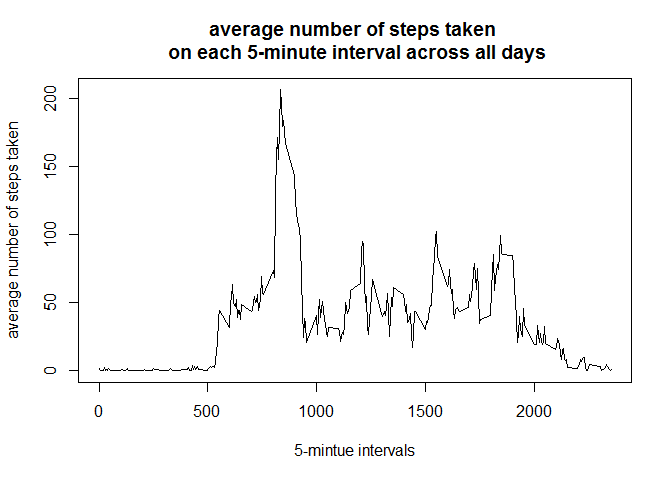

# Reproducible Research: Peer Assessment 1

## Loading and preprocessing the data


```r
activityData <- read.csv("./activity.csv")
activityData$date <- as.Date(activityData$date, "%Y-%m-%d")
```

## What is mean total number of steps taken per day?

1. Calculate the toal number of steps taken per day 
2. make a histogram of them

```r
activityDataSum <- with(activityData, tapply(steps, date, sum, na.rm=TRUE))
hist(activityDataSum, xlab="total number of steps taken per day"
     , main="Histogram of total number of steps taken per day")
```

 

3. Calcuate and report the mean and median of the toal number of steps taken per day

```r
activityMean <- round(mean(activityDataSum))
activityMedian <- round(median(activityDataSum))
```
The mean of the total number of steps taken per day is 9354.

The median of the total number of steps taken per day is 1.0395\times 10^{4}.

## What is the average daily activity pattern?
1. Calculate the average number of steps taken on each 5-minute interval across all days
   and make a time series plot of the 5-minute interval (x-axis), average number of steps 
   taken on each interval (y-axis)

```r
averSteps.Interval <- with(activityData, tapply(steps, interval, mean, na.rm=TRUE))

plot(names(averSteps.Interval), averSteps.Interval, type="l"
     , xlab="5-mintue intervals"
     , ylab="average number of steps taken"
     , main="average number of steps taken \n on each 5-minute interval across all days")
```

 

2. Which 5-minute interval, on average across all the days in the dataset, 
contains the maximum number of steps?

```r
maxSteps <- which(averSteps.Interval == max(averSteps.Interval))
```

The 104th 5-minute interval, "835", contains the maximum number of steps

## Imputing missing values
There are a number of days/intervals where there are missing values (coded as NA). The presence of 
missing days may introduce bias into some calculations or summaries of the data.

1. Calculate and report the total number of missing values in the dataset

```r
missingValues <- is.na(activityData$steps)
totalMissing <- sum(missingValues)
ratioMissing <- mean(missingValues)
```

The total number of missing values is 2304.
The ratio of missing value is 13.1147541 %.

2. Devise a strategy for filling in all of the missing values in the dataset. 
   I use the mean for the 5-minute interval which has missing values.
3. Create a new dataset that is equal to the original dataset but with the missing data filled in
4. Make a histogram of the total number of steps taken each day and calculate and report the mean
   and median total number of steps taken per day. Do these value differ from the estimates from
   the first part of the assignment? What is the impact of imputing missing data on the estimates
   of the total daily number of steps?


```r
activityDataNew <- activityData
activityDataNew[missingValues, "steps"] <- averSteps.Interval[as.character(activityDataNew[missingValues, "interval"])]

activityDataSumNew <- with(activityDataNew, tapply(steps, date, sum, na.rm=TRUE))
hist(activityDataSumNew, xlab="total number of steps taken per day"
     , main="Histogram of total number of steps taken per day \nwith the missing data filled in")
```

 

```r
activityMeanNew <- mean(activityDataSumNew)
activityMedianNew <- median(activityDataSumNew)
```

Before the missing values are imputed,

the mean of total number of steps taken per day is 9354.

the median of total number of steps taken per day is 1.0395\times 10^{4}.

After the missing values are imputed, 

the mean of total number of steps taken per day is 1.0766\times 10^{4}.

the median of total number of steps taken per day is 1.0766\times 10^{4}.

The value differs from the estimates from the first part of the assignment. 
The imputing missing data increases the mean and median of total number of steps taken per day,
    and make the histgram less skewed, and the mean is equal to the median.

## Are there differences in activity patterns between weekdays and weekends?


```r
activityDataNew$week <- weekdays(activityDataNew$date)

weekdayIndx <- activityDataNew$week %in% c("Monday","Tuesday","Wednesday","Thursday","Friday")
activityDataNew[weekdayIndx, "week"] <- "weekday"

weekendIndx <- activityDataNew$week %in% c("Saturday", "Sunday")
activityDataNew[weekendIndx, "week"] <- "weekend"

activityDataNew$week <- as.factor(activityDataNew$week)

averSteps.Interval.week <- aggregate(steps ~ interval + week, data = activityDataNew, mean)

library(ggplot2)
qplot(interval, steps, data=averSteps.Interval.week, geom=c("line"), facets=week~.
      , ylab="number of steps")
```

 

